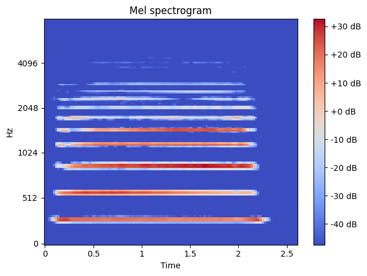
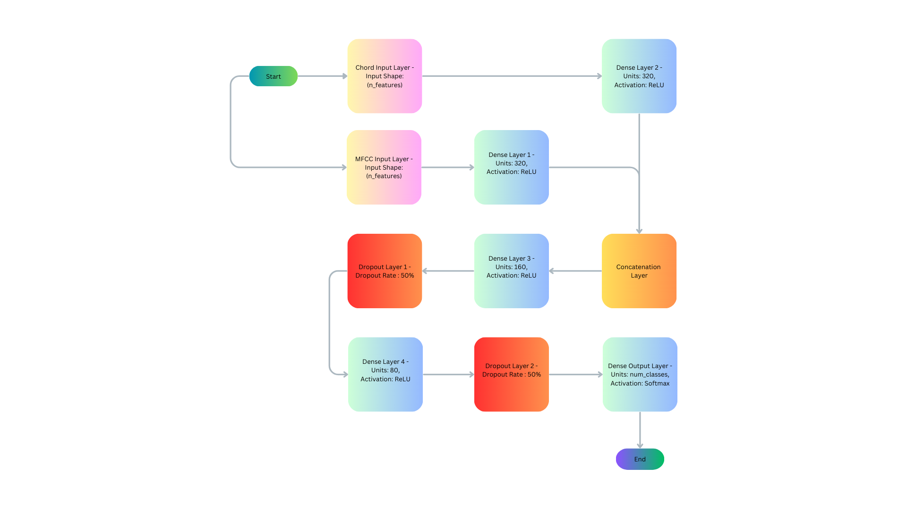
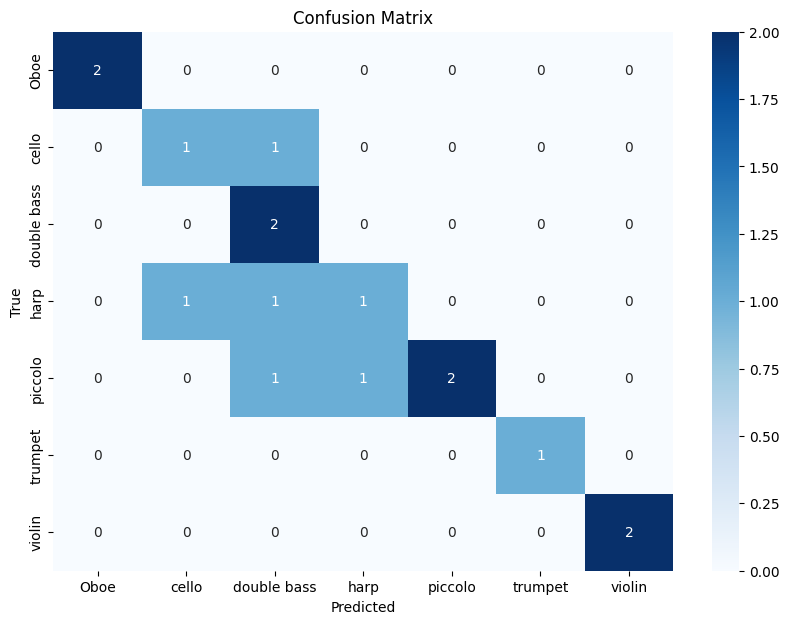

# Symphony Sense: Instrument and Chord Recognition System

## Introduction

**Symphony Sense** is a sophisticated machine learning project designed to automatically recognize musical instruments and chords from audio recordings. Leveraging advanced audio processing techniques, particularly Mel Frequency Cepstral Coefficients (MFCCs) and their temporal derivatives (Delta MFCCs), along with TensorFlow-based neural networks, this project aims to classify and identify different musical components from sound files.

This project was developed by **Syed Adnan Ali** and **Venkata Vivek Kumar Mudunuru**.

## Project Overview

Symphony Sense is a tool that aims to identify musical instruments and chords by analyzing audio data. The project involves several stages, including the extraction of features from audio files, training a neural network to recognize patterns, and evaluating the model's performance. The main components include:

- **Feature Extraction**: Using MFCCs and Delta MFCCs to capture the spectral and temporal characteristics of audio files.
- **Chord Detection**: Identifying chords within audio files using chroma features and templates for major, minor, and noise chords.
- **Instrument Classification**: Training a neural network to recognize different musical instruments based on the extracted features.
- **Evaluation**: Assessing the model's performance using metrics such as confusion matrices.

## Understanding MFCCs and Delta MFCCs

### Mel Frequency Cepstral Coefficients (MFCCs)

MFCCs are widely used features in audio processing that represent the short-term power spectrum of sound. They are particularly effective in capturing the timbral characteristics of audio signals, making them invaluable for tasks such as speech recognition and music analysis.




### Delta MFCCs

Delta MFCCs extend MFCCs by capturing the rate of change of these coefficients over time, effectively representing the temporal dynamics of the audio signal. This additional information is crucial for distinguishing between different musical instruments and identifying chord progressions.

## Data Processing and Feature Extraction

### Processing Audio Files

The project processes audio files from different musical instruments, such as violin, cello, trumpet, etc., to detect chords and classify instruments. The steps include:

1. **Loading Audio Files**: Audio files are loaded from the specified directory.
2. **Feature Extraction**: MFCCs and Delta MFCCs are extracted to capture the spectral and temporal characteristics of the audio.
3. **Chord Detection**: Chords are identified using chroma features and matching them with predefined templates for major, minor, and noise chords.

### Stereo vs. Mono Processing

The project handles stereo recordings by processing each channel independently. This approach ensures that the chord detection is more accurate, as different instruments or vocals might dominate different channels.

For example, in a stereo recording of a live concert, the guitar might be more prominent in the left channel, while the vocals are more prominent in the right channel. Processing these channels separately allows for a more detailed analysis of the chords.

## Model Training and Evaluation

### Neural Network Design

The neural network is designed using TensorFlow and is trained on the extracted features (MFCCs and Delta MFCCs) to classify different musical instruments. The model's architecture is tailored to process the spectral and temporal features captured by these coefficients.



### Evaluation Metrics

The model's performance is evaluated using a confusion matrix and classification report. These tools help visualize the accuracy of the model and identify any areas for improvement.



The confusion matrix above shows the model's performance in classifying different musical instruments. Each row represents the true class, while each column represents the predicted class. The diagonal elements indicate correct predictions.

## Running the Project

### Prerequisites

Ensure you have the following Python libraries installed:

```bash
pip install tensorflow numpy pandas matplotlib seaborn librosa
```

### Setting Up the Data

Prepare Audio Files: Collect and organize your audio files in a format compatible with librosa (.wav files).

Google Drive Configuration:

Run the following code snippet in your Google Colab notebook to create the data folder in your Google Drive's MyDrive directory:
python

```bash
from google.colab import drive
import os

# Mount Google Drive
drive.mount('/content/drive')

# Create the 'data' folder in MyDrive
data_path = '/content/drive/MyDrive/data'
if not os.path.exists(data_path):
    os.makedirs(data_path)
    print(f"'{data_path}' directory created successfully!")
else:
    print(f"'{data_path}' directory already exists.")
```   
Place all your audio files in this data folder.
Note: The paths in the code are configured to look for files in MyDrive/data/. Ensure that your audio files are correctly placed in this directory.

### Running the Code

1. **Execute the Notebook**: Run the notebook in a Python environment with Google Drive integration (e.g., Google Colab).

2. **Data Processing and Feature Extraction**:
   - The notebook will load the audio files from the `data/` directory.
   - MFCCs and Delta MFCCs will be extracted and prepared for model training.

3. **Model Training and Evaluation**:
   - The neural network will be trained on the extracted features.
   - The model’s performance will be evaluated and visualized using metrics such as confusion matrices and classification reports.

### Saving and Viewing Results

- The detected chords and instrument classifications are saved to a CSV file for further analysis.

## Code Explanation

- **Data Loading and Preparation**: The notebook handles the loading, preprocessing, and splitting of data into training, validation, and test sets.
- **Feature Extraction**: MFCCs and Delta MFCCs are extracted to capture the spectral and temporal dynamics of the audio files.
- **Model Architecture**: The neural network includes layers optimized for processing the extracted features and classifying instruments.
- **Training and Evaluation**: The model is trained using the Adam optimizer and evaluated using standard metrics.

## Contribution

Contributions to Symphony Sense are welcome! Please submit issues or pull requests to improve the project.
